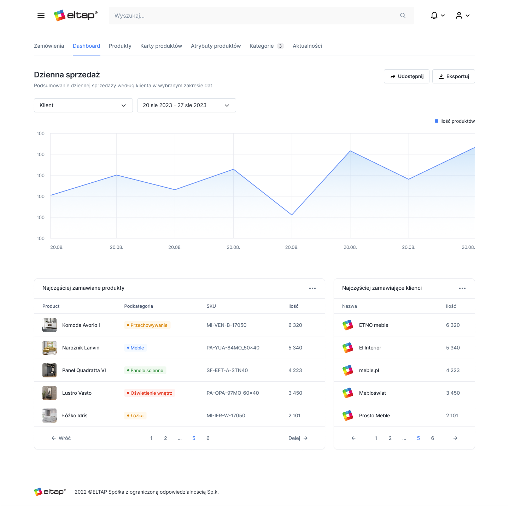

# Furniture Distributor - Admin Application
Internal page for an admin application that manages a segment of furniture distributors.

## Deployment
This application is deployed on Vercel. You can access the live deployment [here](https://furniture-dashboard-three.vercel.app/).

## Created with Figma
The design for this application was created using Figma. You can access the design mock-ups and UI elements used for this project [here](https://www.figma.com/file/k4Cm4wB9IgGGO0Q7KvfpPm/Zadanie-testowe-%7C-Front-end-Developer?type=design&node-id=169%3A7681&mode=design&t=DlNcOkZ61eEPwSbf-1).

## API
The API used for this project can be found [here](https://api-test.eltap.com/index.html). This API provides test data and follows the Swagger documentation provided.


## Technologies Used

- **Typescript**: A typed superset of JavaScript that enhances the development experience and catches common programming mistakes.

- **React**: A popular JavaScript library for building user interfaces.

- **Next.js (App Router)**: A React framework that allows for server-rendered or statically generated web applications.

- **TailwindCSS**: A utility-first CSS framework that makes designing responsive and visually appealing user interfaces a breeze.

- **Tremor**: A component library providing various functionalities like charts, datepicker, and other UI components for enhancing the application's user experience.

- **Swiper**: A powerful and customizable carousel/slider library for creating interactive and engaging presentations or image sliders within the application.

## Preview


## Getting Started

1. Clone the repository using the following command:
   
```bash
  git clone https://github.com/energywraith/furniture-dashboard.git
```

2. Navigate to the project directory:
   
```bash
  cd furniture-dashboard
```

3. Install dependencies:
   
```bash
  npm install
```

4. Start the application:
   
```bash
  npm run dev
```

Open [http://localhost:3000](http://localhost:3000) with your browser to see the result.
